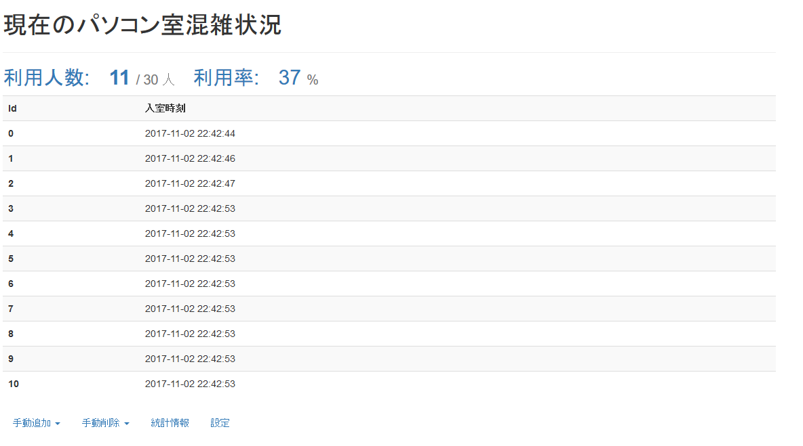

Flask-RoomStatus on Heroku
===

Raspberry Piとセンサを用いたPC室の入退室管理IoTアプリケーション。
現在はラズパイが稼働していません。

## Service URL
-> https://frozen-island-37316.herokuapp.com

## Constitution
- Device(Raspberry Pi) Program: [device.py](https://github.com/aoisupersix/Flask-RoomStatus/blob/master/device.py)
- Server(Flask) Program: [app.py](https://github.com/aoisupersix/Flask-RoomStatus/blob/master/app.py)
- Indexpage HTML: [templates/index.html](https://github.com/aoisupersix/Flask-RoomStatus/blob/master/templates/index.html)

## Author
[aoisupersix](https://github.com/aoisupersix)
